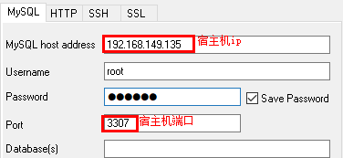

## Docker 应用部署

### 一、部署MySQL

1. 搜索mysql镜像

```shell
docker search mysql
```

2. 拉取mysql镜像

```shell
docker pull mysql:5.6
```

3. 创建容器，设置端口映射、目录映射

```shell
# 在/root目录下创建mysql目录用于存储mysql数据信息
mkdir -p ~/dockerSoftware/mysql
cd ~/dockerSoftware/mysql
```

```shell
docker run -id \
-p 3307:3306 \
--name=c_mysql \
-v $PWD/conf:/etc/mysql/conf.d \
-v $PWD/logs:/logs \
-v $PWD/data:/var/lib/mysql \
-e MYSQL_ROOT_PASSWORD=123456 \
mysql:5.6
```

- 参数说明：
  - **-p 3307:3306**：将容器的 3306 端口映射到宿主机的 3307 端口。
  - **-v $PWD/conf:/etc/mysql/conf.d**：将主机当前目录下的 conf/my.cnf 挂载到容器的 /etc/mysql/my.cnf。配置目录
  - **-v $PWD/logs:/logs**：将主机当前目录下的 logs 目录挂载到容器的 /logs。日志目录
  - **-v $PWD/data:/var/lib/mysql** ：将主机当前目录下的data目录挂载到容器的 /var/lib/mysql 。数据目录
  - **-e MYSQL_ROOT_PASSWORD=123456：**初始化 root 用户的密码。


4. 进入容器，操作mysql

```shell
docker exec -it c_mysql /bin/bash
#登入mysql
mysql -uroot -p123456
#mysql命令，显示数据库
show databases;
#创建数据库
create database db1;
#使用数据库
use db1;
#显示所有表
show tables;

```

5. 使用外部机器连接容器中的mysql



6. 操作mysql
```shell
use db1;
create table user(
		id int primary key,
        username varchar(32),
        password varchar(32)
);
INSERT INTO `db1`.`user` (`id`, `username`, `password`) VALUES ('1', 'test', '123');
SELECT * FROM db1.user;
```


### 二、部署Tomcat

1. 搜索tomcat镜像

```shell
docker search tomcat
```

2. 拉取tomcat镜像

```shell
docker pull tomcat
```

3. 创建容器，设置端口映射、目录映射

```shell
# 在/root目录下创建tomcat目录用于存储tomcat数据信息
mkdir -p ~/dockerSoftware/tomcat
cd ~/dockerSoftware/tomcat
```

```shell
docker run -id --name=c_tomcat \
-p 8080:8080 \
-v $PWD:/usr/local/tomcat/webapps \
tomcat
```

- 参数说明：
  - **-p 8080:8080：**将容器的8080端口映射到主机的8080端口
  
    **-v $PWD:/usr/local/tomcat/webapps：**将主机中当前目录挂载到容器的webapps

4. 在宿主机tomcat目录下写入一个html文件
```shell
mkdir test
cd test 
vim a.html
# 写入： <h1>hello tomcat docker</h1>
```

6. 使用外部机器访问tomcat


### 三、部署Nginx

1. 搜索nginx镜像

```shell
docker search nginx
```

2. 拉取nginx镜像

```shell
docker pull nginx
```

3. 创建容器，设置端口映射、目录映射


```shell
# 在/root目录下创建nginx目录用于存储nginx数据信息
mkdir -p ~/dockerSoftware/nginx/conf
cd ~/dockerSoftware/nginx/conf
# 在~/dockerSoftware/nginx/conf/下创建nginx.conf文件,粘贴下面内容
vim nginx.conf
```

```shell
user  nginx;
worker_processes  1;

error_log  /var/log/nginx/error.log warn;
pid        /var/run/nginx.pid;


events {
    worker_connections  1024;
}


http {
    include       /etc/nginx/mime.types;
    default_type  application/octet-stream;

    log_format  main  '$remote_addr - $remote_user [$time_local] "$request" '
                      '$status $body_bytes_sent "$http_referer" '
                      '"$http_user_agent" "$http_x_forwarded_for"';

    access_log  /var/log/nginx/access.log  main;

    sendfile        on;
    #tcp_nopush     on;

    keepalive_timeout  65;

    #gzip  on;

    include /etc/nginx/conf.d/*.conf;
}
```


```shell
cd ~/dockerSoftware/nginx
docker run -id --name=c_nginx \
-p 80:80 \
-v $PWD/conf/nginx.conf:/etc/nginx/nginx.conf \
-v $PWD/logs:/var/log/nginx \
-v $PWD/html:/usr/share/nginx/html \
nginx
```

- 参数说明：
  - **-p 80:80**：将容器的 80端口映射到宿主机的 80 端口。
  - **-v $PWD/conf/nginx.conf:/etc/nginx/nginx.conf**：将主机当前目录下的 /conf/nginx.conf 挂载到容器的 :/etc/nginx/nginx.conf。配置目录
  - **-v $PWD/logs:/var/log/nginx**：将主机当前目录下的 logs 目录挂载到容器的/var/log/nginx。日志目录

4. 在宿主机html目录下写入一个html文件
```shell
cd ~/dockerSoftware/nginx/html/
vim index.html
# 写入： <h1>hello nginx docker</h1>
```

5. 使用外部机器访问nginx


### 四、部署Redis

1. 搜索redis镜像

```shell
docker search redis
```

2. 拉取redis镜像

```shell
docker pull redis:5.0
```

3. 创建容器，设置端口映射

```shell
docker run -id --name=c_redis -p 6379:6379 redis:5.0
docker start c_redis
```

4. 使用外部机器连接redis

```shell
./redis-cli.exe -h 192.168.149.135 -p 6379
```


